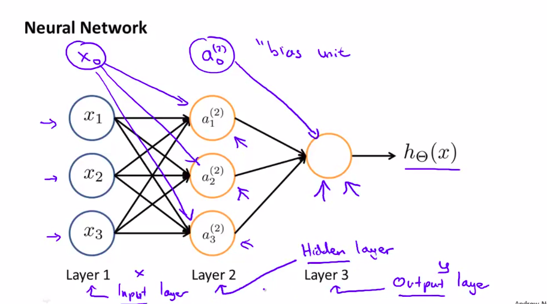

# Week 04

- Motivations
- Neural Networks
- Applications

------

## Motivation

Non-linear classification and use more than 5000 features, so sigmoid function g will be complicated. 

$\Rightarrow$ Complex

Computer vision problem:

- A car is a matrix for a computer.
- For a car, look and store specific pixels.
- Give the algorithm a list of car images so it learns what is a car.
- A pixel is feature so the calculation will be complex.

Neural network:

- Algorithm trying to mimic the brain
- 80'

## Neural networks

Neuron model: Logistic unit

$x_0, x_1, x_2, x_3 \Rightarrow [wires] \Rightarrow h_\theta(x)$; $x_0 = 1$ bias unit

$h_\theta(x) = \frac{1}{1+e^{-\theta^Tx}}$  $x = \begin{bmatrix} x_0 \\ x_1 \\ x_2 \\ x_3 \end{bmatrix}$ $\theta = \begin{bmatrix} \theta_0 \\ \theta_1 \\ \theta_2 \\ \theta_3 \end{bmatrix}$ 

sigmoid (logistic) activation function $g(z) = \frac{1}{1+e^{-z}}$ 

$\Theta^{(j)}$ = matrix of weights controlling function mapping from layer $j$ to layer $j+1$

$a_i^{(j)}$ = "activation" of unit $i$ in layer $j$

This is saying that we compute our activation nodes by using a 3×4 matrix of parameters. 

$a_1^{(2)} = g(\Theta_{10}^{(1)}x_0 + \Theta_{11}^{(1)}x_1 + \Theta_{12}^{(1)}x_2 + \Theta_{13}^{(1)}x_3)$ 

$a_2^{(2)} = g(\Theta_{20}^{(1)}x_0 + \Theta_{21}^{(1)}x_1 + \Theta_{22}^{(1)}x_2 + \Theta_{23}^{(1)}x_3)$

$a_3^{(2)} = g(\Theta_{30}^{(1)}x_0 + \Theta_{31}^{(1)}x_1 + \Theta_{32}^{(1)}x_2 + \Theta_{33}^{(1)}x_3)$ 

$h_\Theta(x) = a_1^{(3)} = g(\Theta_{10}^{(2)}a_0^{(2)} + \Theta_{11}^{(2)}a_1^{(2)} + \Theta_{12}^{(2)}a_2^{(2)} + \Theta_{13}^{(2)}a_3^{(2)})$

Example: If layer 1 has 2 input nodes and layer 2 has 4 activation nodes. Dimension of $\Theta^{(1)}$ is going to be 4×3 where $s_j = 2$ and $s_{j+1} = 4$, so $s_{j+1} \times (s_j + 1) = 4 \times 3$

#### Forward Propagation: Vectorized implementation 

$a_1^{(2)} = g(z_1^{(2)})$

$a_2^{(2)} = g(z_2^{(2)})$

$a_3^{(2)} = g(z_3^{(2)})$

$z^{(2)} = \begin{bmatrix} z_1^{(2)}\\z_2^{(2)}\\z_3^{(2)} \end{bmatrix} $

$z^{(2)} = \Theta^{(1)} a^{(1)}$

$a^{(2)} = g(z^{(2)})$

Add $a_0^{(2)} = 1$ 

$z^{(3)} = \Theta^{(2)} a^{(2)}$

$h_\Theta(x) = a^{(3)} = g(z^{(3)})$

Example

$a(2) = ?$ 

$z(2)=Θ(1)a(1); a(2)=g(z(2))$ 

Summary

$z^{(j)}=Θ^{(j−1)}a^{(j−1)}$ 

$a^{(j)}=g^{(z(j))}$

$hΘ^{(x)}=a^{(j+1)}=g(z^{(j+1)})$ 

## Applications

- $AND; x_1, x_2 \in{0,1}; y = x_1 \text{ AND } x_2$ 

  Graph: $\begin{bmatrix}x_0 \\ x_1\\x_3 \end{bmatrix} \rightarrow g(z^{(2)}) \rightarrow h_\Theta(x)$

  $\Theta^{(1)} = \begin{bmatrix}-30 & 20 & 20 \end{bmatrix}$

  $h_\Theta(x) = g(\Theta_{10}^{(1)} + \Theta_{11}^{(1)} + \Theta_{12}^{(1)}) = g(-30 + 20x_1 + 20x_2)$  

  $g(z) =$ __/￣

  | $x_1$ | $x_2$ | $y$        |
  | ----- | ----- | ---------- |
  | 0     | 0     | g(-30) = 0 |
  | 0     | 1     | g(-10) = 0 |
  | 1     | 0     | g(-10) = 0 |
  | 1     | 1     | g(10) = 1  |

$AND \Rightarrow \Theta^{(1)} = \begin{bmatrix}-30 & 20 & 20 \end{bmatrix}$

$OR \Rightarrow \Theta^{(1)} = \begin{bmatrix}-10 & 20 & 20 \end{bmatrix}$

$NOT x_1 \text{ AND } NOT x_2 \Rightarrow \Theta^{(1)}= \begin{bmatrix}10 & -20 & -20 \end{bmatrix}$

$NOR \Rightarrow \Theta^{(1)} = \begin{bmatrix}10 & -20 & -20 \end{bmatrix}$

------

$XNOR$

Graph: $\begin{bmatrix}x_0 \\ x_1\\x_3 \end{bmatrix} \rightarrow \begin{bmatrix}a_1^{(2)} \\ a_2^{(2)} \end{bmatrix} \rightarrow \begin{bmatrix}a^{(3)} \end{bmatrix} \rightarrow h_\Theta(x)$

For the transition between the first and second layer, we'll use a $Θ^{(1)}$ matrix that combines the values for AND and NOR:

$\Theta^{(1)} = \begin{bmatrix}-30 & 20 & 20 \\ 10 & -20 & -20 \end{bmatrix}$

For the transition between the second and third layer, we'll use a $Θ^{(2)}$ matrix that uses the value for OR:

$ \Theta^{(2)} = \begin{bmatrix}-10 & 20 & 20 \end{bmatrix}$

Values for all our nodes:

$a^{(2)} = g(\Theta{(1)}.x)$ 

$a^{(3)} = g(\Theta{(2)}.a^{(2)})$ 

$h_\Theta(x) = a^{(3)}$ 

#### Multiclass Classification

To classify data into multiple classes, we let our hypothesis function return a vector of values. 

If it is class C1 return $\begin{bmatrix}0\\1\\0\end{bmatrix}$

We can define our set of resulting classes as $y$. Each $y^{(i)}$ represents a different image corresponding to either a car, pedestrian, truck, or motorcycle.

The inner layers, each provide us with some new information which leads to our final hypothesis function. The setup looks like:

$\begin{bmatrix}x_0\\..\\x_n\end{bmatrix} \rightarrow \begin{bmatrix}a_1^{2}\\a_0^{2}\\..\end{bmatrix}  \rightarrow .. \rightarrow \begin{bmatrix}h_\Theta(x)_1 \\..\\h_\Theta(x)_4\end{bmatrix}$