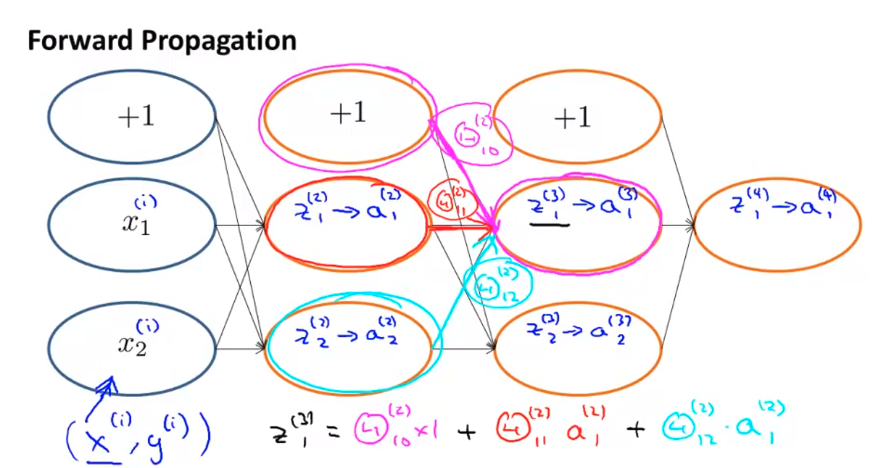
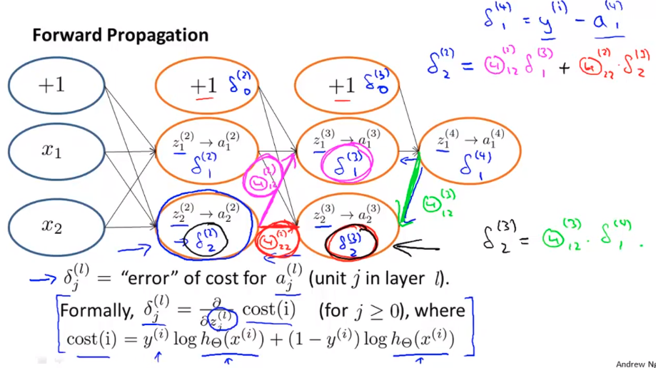

# Week 05

Neural Networks: Learning

- Cost Function and Backpropagation
- Backpropagation in Practice
- Application of Neural Networks

------

### I. Cost Function and Backpropagation

#### 1. Cost function

- L = total number of layers in the network

- $s_l$ = number of units (not counting bias unit) in layer $l$

- K = number of output units/classes

- $h\Theta(x)_k$ as being a hypothesis that results in the $k^{th}$ output

- Cost function for neural networks is going to be a generalization of the one we used for logistic regression.

- Cost function for regularized logistic regression was:

  $J(\theta) = - \frac{1}{m} \sum_{i=1}^m [ y^{(i)}\ \log (h_\theta (x^{(i)})) + (1 - y^{(i)})\ \log (1 - h_\theta(x^{(i)}))] + \frac{\lambda}{2m}\sum_{j=1}^n \theta_j^2 $

- For neural networks, it is going to be slightly more complicated:

  $J(\Theta) = - \frac{1}{m} \sum_{i=1}^m \sum_{k=1}^K \left[y^{(i)}_k \log ((h_\Theta (x^{(i)}))_k) + (1 - y^{(i)}_k)\log (1 - (h_\Theta(x^{(i)}))_k)\right] + \frac{\lambda}{2m}\sum_{l=1}^{L-1} \sum_{i=1}^{s_l} \sum_{j=1}^{s_{l+1}} ( \Theta_{j,i}^{(l)})^2$

  - At first, nested summation that loops through the number of output nodes.
  - In the regularization part, after the square brackets, we must account for multiple theta matrices. The number of columns in our current theta matrix is equal to the number of nodes in our current layer (including the bias unit). The number of rows in our current theta matrix is equal to the number of nodes in the next layer (excluding the bias unit). As before with logistic regression, we square every term.
  - Note:
    - the double sum simply adds up the logistic regression costs calculated for each cell in the output layer
    - the triple sum simply adds up the squares of all the individual Θs in the entire network.
    - the i in the triple sum does **not** refer to training example i

#### 2. Backpropagation algorithm

- "Backpropagation" is neural-network terminology for minimizing the cost function (like gradient descent in logistic and linear regression).

- Our goal is to compute: $\min_\Theta J(\Theta)$m 

- Minimize $J$ using an optimal set of parameters in $\Theta$. Let's look at the equations to compute the partial derivative of J(Θ): $\dfrac{\partial}{\partial \Theta_{i,j}^{(l)}}J(\Theta)$ 

- To do so, we use the following algorithm:

  - Training set: ${(x^{(1)}, y^{(1)}), .., (x^{(m)}, y^{(m)})}$
  - Set $\Delta_{i,j}^{(l)} = 0$ for all $i, j, l$ 
  - For $i=1$ to $m$ 
    - set $a^{(1)} = a^{(i)}$
    - perform FP for $a^{(1)}$ for $l = 2, .., L$
    - using $y^{(i)}$ compute $\delta^{(L)} = a^{(L)} - y^{(i)}$ 
    - compute $\delta^{(L-1)}, \delta^{(L-2)}, ..., \delta^{(2)} \text{ and no } \delta^{(1)}$    
    - $\Delta_{i,j}^{(l)} := \Delta_{i,j}^{(l)} + a_j^{(l)}\delta^{(l+1)} $ 
  - $D_{i,j}^{(l)} = 1/m * \Delta_{i,j}^{(l)} + \lambda \Theta_{ij}^{(l)}$  if $j != 0 $
  - $D_{i,j}^{(l)} = 1/m * \Delta_{i,j}^{(l)}$  if $j = 0$  
  - Note: $\dfrac{\partial}{\partial \Theta_{i,j}^{(l)}}J(\Theta) = D_{ij}^{(l)}$  

  Example:

  Given training example $(x, y)$ 

  $a^{(1)} = x$

  $z^{(2)} = \Theta^{(1)} a^{(1)} $

  $a^{(2)} = g(z^{(2)})$ add $a^{(2)}_0$ 

  $z^{(3)} = \Theta^{(2)}a^{(2)}$ 

  $a^{(3)} = g(z^{(3)})$ add $a^{(3)}_0$  

  $z^{(4)} = \Theta^{(3)}a^{(3)}$ 

  $a^{(4)} = h_\Theta(x) = g(z^{(3)})$  

  ....

#### 3. Backpropagation algorithm 





### II. Backpropagation in Practice

#### 1. Implementation

With neural networks, we are working with sets of matrices:

- $\Theta^{(1)}, \Theta^{(2)},…$ 
- $D(1), D(2), …$

In order to use optimizing functions such as "fminunc()", we will want to "unroll" all the elements and put them into one long vector: 

```
thetaVector = [ Theta1(:); Theta2(:); Theta3(:); ]
deltaVector = [ D1(:); D2(:); D3(:) ]
```

If the dimensions of Theta1 is 10x11, Theta2 is 10x11 and Theta3 is 1x11, then we can get back our original matrices from the "unrolled" versions as follows:

```
Theta1 = reshape(thetaVector(1:110),10,11)
Theta2 = reshape(thetaVector(111:220),10,11)
Theta3 = reshape(thetaVector(221:231),1,11)
```


#### 2. Gradient checking

Gradient checking will assure that our backpropagation works as intended. We can approximate the derivative of our cost function with:

$\dfrac{\partial}{\partial\Theta}J(\Theta) \approx \dfrac{J(\Theta + \epsilon) - J(\Theta - \epsilon)}{2\epsilon}$  

With multiple theta matrices, we can approximate the derivative **with respect to** $Θ_j$ as follows:

$\dfrac{\partial}{\partial\Theta_j}J(\Theta) \approx \dfrac{J(\Theta_1, \dots, \Theta_j + \epsilon, \dots, \Theta_n) - J(\Theta_1, \dots, \Theta_j - \epsilon, \dots, \Theta_n)}{2\epsilon}  $

A small value for ${\epsilon}$ (epsilon) such as ${\epsilon = 10^{-4}}$, guarantees that the math works out properly. If the value for $\epsilon$ is too small, we can end up with numerical problems.

Hence, we are only adding or subtracting epsilon to the $\Theta_j$ matrix. In octave we can do it as follows:

```
epsilon = 1e-4;
for i = 1:n,
  thetaPlus = theta;
  thetaPlus(i) += epsilon;
  thetaMinus = theta;
  thetaMinus(i) -= epsilon;
  gradApprox(i) = (J(thetaPlus) - J(thetaMinus))/(2*epsilon)
end;
```

We previously saw how to calculate the deltaVector. So once we compute our gradApprox vector, we can check that gradApprox ≈ deltaVector.

Once you have verified **once** that your backpropagation algorithm is correct, you don't need to compute gradApprox again. The code to compute gradApprox can be very slow.

#### 3. Random initialization

Initializing all theta weights to zero does not work with neural networks. When we backpropagate, all nodes will update to the same value repeatedly. Instead we can randomly initialize our weights for our $\Theta$ matrices using the following method $\Rightarrow$ Symmetry breaking: init each $\Theta_{ij}^{(l)}$ to a random value in $[-epsilon, +epsilon]$

```matlab
If the dimensions of Theta1 is 10x11, Theta2 is 10x11 and Theta3 is 1x11.

Theta1 = rand(10,11) * (2 * INIT_EPSILON) - INIT_EPSILON;
Theta2 = rand(10,11) * (2 * INIT_EPSILON) - INIT_EPSILON;
Theta3 = rand(1,11) * (2 * INIT_EPSILON) - INIT_EPSILON;
```

#### 4. Summary

Do NN?

- Pick a network architecture and a layout of your neural network, including how many hidden units in each layer and how many layers in total you want to have.
  - Number of input units = dimension of features $x^{(i)}$
  - Number of output units = number of classes = $\begin{bmatrix} 1 \\ .. \\ n \end{bmatrix}$
  - Number of hidden units per layer 
  - Defaults: 1 hidden layer. If you have more than 1 hidden layer, then it is recommended that you have the same number of units in every hidden layer. 


**Training a Neural Network**

1. Randomly initialize the weights
2. Implement forward propagation to get $h_\Theta(x^{(i)})$ for any $x^{(i)}$
3. Implement the cost function
4. Implement backpropagation to compute partial derivatives
5. Use gradient checking to confirm that your backpropagation works. Then disable gradient checking.
6. Use gradient descent or a built-in optimization function to minimize the cost function with the weights in theta.

When we perform forward and back propagation, we loop on every training example:

```
for i = 1:m,
   Perform forward propagation and backpropagation using example (x(i),y(i))
   (Get activations a(l) and delta terms d(l) for l = 2,...,L
```


The cost function $J(\Theta)$ measures how well the neural network fits the training data.

Maximum: $h_\Theta(x^{(i)})$ far from $y^{(i)}$; Minimum: $h_\Theta(x^{(i)})$ $\approx$ $y^{(i)}$ and $J(\Theta)$ is low; Gradient will go the the minimum;

### III. Application of Neural Networks