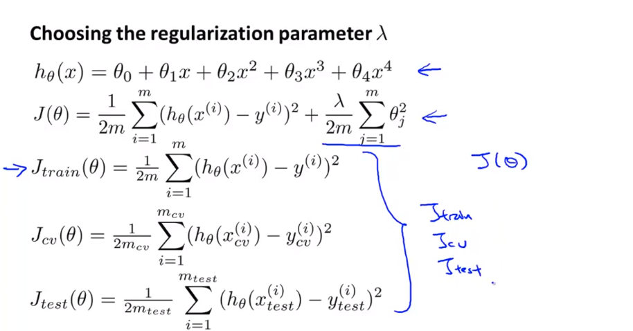
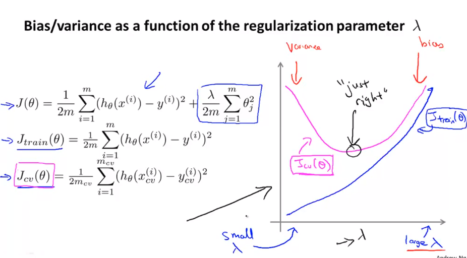
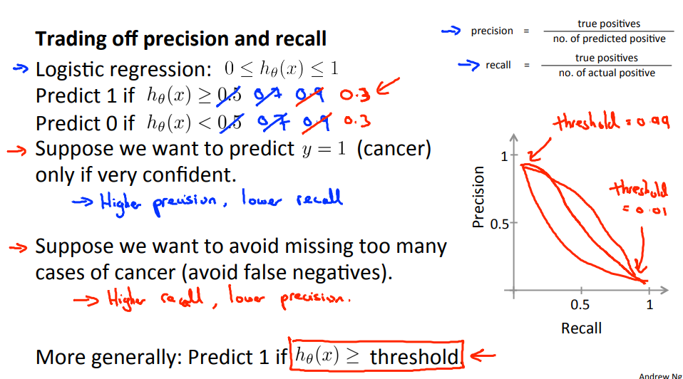
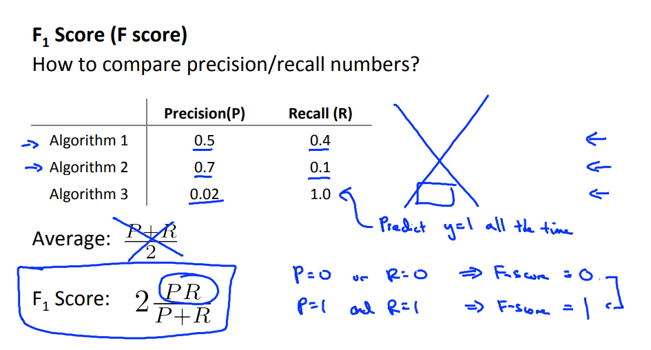
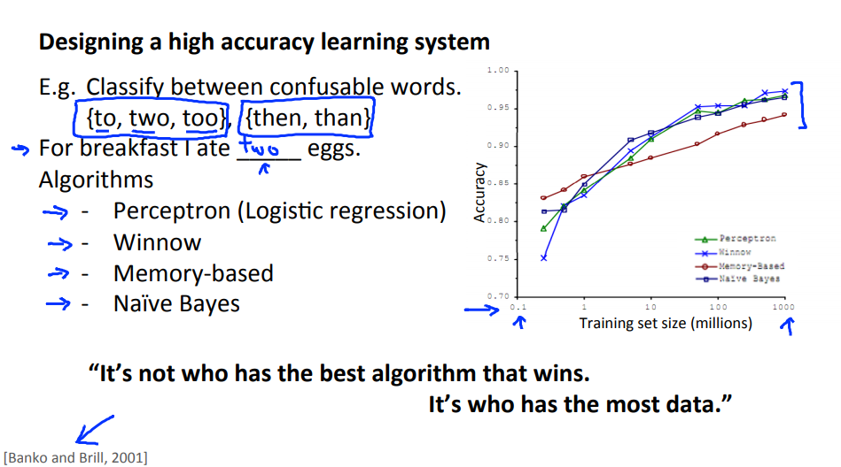
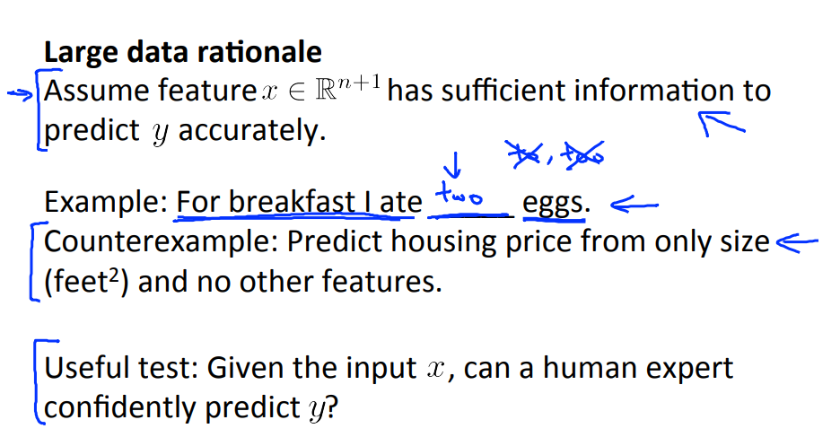
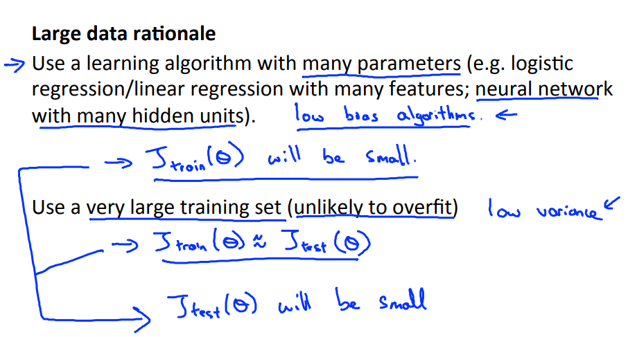

# Week 06

- Advice for Applying Machine Learning
  - Evaluating a Learning Algorithm
  - Bias vs. Variance
- Machine Learning System Design
  - Building a Spam Classifier
  - Handling Skewed Data
  - Using Large Data Sets

------

## I. Advice for Applying Machine Learning

### 1. Evaluating a Learning Algorithm

#### a. Deciding What to Try Next

- Debug a learning algorithm: Get more training examples, Try smaller features, Get additional features, Add polynomial features, Increase/ Decrease $\lambda$.
- Machine Learning diagnostic: test to run what is working/ guidance to improve/ take time to implement.

#### b. Evaluating hypothesis 

- A hypothesis may have a low error for the training examples but still be inaccurate (because of overfitting). To evaluate a hypothesis, split up the data into two sets: a **training set** as 70 % and a **test set**. 
- The new procedure using these two sets is then:
  - Learn$ \Theta$ and minimize$ J_{train}(\Theta)$ using the training set
  - Compute the test set error $J_{test}(\Theta)$
- The test set error: 
  - For linear regression: $J_{test}(\Theta) = \dfrac{1}{2m_{test}} \sum_{i=1}^{m_{test}}(h_\Theta(x^{(i)}_{test}) - y^{(i)}_{test})^2$ 
  - For classification ~ Misclassification error (aka 0/1 misclassification error):
    - $err(h_\Theta(x),y) = 1 if h_\Theta(x)≥0.5 and y=0 or h_\Theta(x)<0.5 and y=1$ 
    - $err(h_\Theta(x),y) = 0 otherwise$ 
  - This gives us a binary 0 or 1 error result based on a misclassification. The average test error for the test set is:
    - Test Error = $m_test \sum_{i=1}^{m_test}=err(h_\Theta(x_test^{(i)}), y_test^{(i)})$
    - This gives us the proportion of the test data that was misclassified.

#### c. Model Selection and Train/Validation/Test Sets

- Learning algorithm fits a training set well, 
  - It does not mean it is a good hypothesis => Could be over fit = {predictions on the test set would be poor}
  - Error of hypothesis on the data set of training will be lower than the error on any other data set.
- Given many models with different polynomial degrees, you can test each degree of polynomial and look at the error result and choose the model of your hypothesis.
- One way to break down our dataset into the three sets is:
  - Training set: 60%
  - Cross validation set: 20%
  - Test set: 20%

We can now calculate three separate error values for the three different sets using the following method:

1. Optimize the parameters in $\Theta$ using the training set for each polynomial degree.
2. Find the polynomial degree d with the least error using the cross validation set.
3. Estimate the generalization error using the test set with $J_{test}(\Theta^{(d)})$, (d = polynomial degree);

This way, the degree of the polynomial d has not been trained using the test set.

### Bias vs. Variance

#### a. Diagnosing Bias vs. Variance

Relationship between the degree of the polynomial $d$ and the underfitting or overfitting of our hypothesis.

- We need to distinguish whether **bias** or **variance** is the problem contributing to bad predictions.

  - High bias is underfitting 

  - High variance is overfitting.

    $\Rightarrow$ Ideally, we need to find a golden mean between these two

The training error will tend to **decrease** as we increase the degree d of the polynomial.

At the same time, the cross validation error will tend to **decrease** as we increase d up to a point, and then it will **increase** as d is increased, forming a convex curve.

**High bias (underfitting)**: both $J_{train}(\Theta)$ and $J_{CV}(\Theta)$ will be high. Also, $J_{CV}(\Theta) \approx J_{train}(\Theta)$.

**High variance (overfitting)**: $J_{train}(\Theta)$ will be low and $J_{CV}(\Theta)$ will be much greater than $J_{train}(\Theta)$.

#### b. Regularization and Bias/Variance

- See that as: 

  - $\lambda$ increases, our fit becomes more rigid. 
  - $\lambda$ approaches 0, we tend to over overfit the data. 

  $\Rightarrow$ choose parameter $\lambda$ to get it 'just right' ? 

  

  To choose the model and the regularization term $\lambda$, we need to:

  1. Create a list of lambdas (i.e. $ \lambda \in {0, 0.01, .. , 10.24}$);
  2. Create a set of models with different degrees or any other variants.
  3. Iterate through the $\lambda$'s and for each $\lambda$ go through all the models to learn some $\Theta$.
  4. Compute the cross validation error using the learned $\Theta$ (computed with $\lambda$) on the $J_{CV}(\Theta)$ **without** regularization or $\lambda$ = 0.
  5. Select the best combo that produces the lowest error on the cross validation set.
  6. Using the best combo $\Theta$ and $\lambda$, apply it on $J_{test}(\Theta)$ to see if it has a good generalization of the problem.

#### 

#### c. Learning Curves

- Training an algorithm on a very few number of data points (such as 1, 2 or 3) will easily have 0 errors because we can always find a quadratic curve that touches exactly those number of points. Hence:
  - As the training set gets larger, the error for a quadratic function increases.
  - The error value will plateau out after a certain m, or training set size.

**Experiencing high bias:**

**Low training set size**: causes $J_{train}(\Theta)$ to be low and $J_{CV}(\Theta)$ to be high.

**Large training set size**: causes both $J_{train}(\Theta)$ and $J_{CV}(\Theta)$ to be high with $J_{train}(\Theta) \approx J_{CV}(\Theta)$.

If a learning algorithm is suffering from **high bias**, getting more training data will not **(by itself) **help much.

**Experiencing high variance:**

**Low training set size**: $J_{train}(\Theta)$ will be low and $J_{CV}(\Theta)$ will be high.

**Large training set size**: $J_{train}(\Theta)$ increases with training set size and $J_{CV}(\Theta)$ continues to decrease without leveling off. Also, $J_{train}(\Theta) < J_{CV}(\Theta)$ but the difference between them remains significant.

If a learning algorithm is suffering from **high variance**, getting more training data is likely to help.

#### d. Deciding What to Do Next Revisited

- Our decision process can be broken down as follows:
  - **Getting more training examples:** Fixes high variance
  - **Trying smaller sets of features:** Fixes high variance
  - **Adding features:** Fixes high bias
  - **Adding polynomial features:** Fixes high bias
  - **Decreasing $\lambda$:** Fixes high bias
  - **Increasing $\lambda$:** Fixes high variance.

- **Diagnosing Neural Networks**
  - A NN with fewer parameters is **prone to underfitting**. It is also **computationally cheaper**.

  - A large NN with more parameters is **prone to overfitting**. It is also **computationally expensive**. 

    - In this case you can use regularization (increase $\lambda$) to address the overfitting.

    Using a single hidden layer is a good starting default. You can train your nn on a number of hidden layers using your cross validation set. You can then select the one that performs best.

- **Model Complexity Effects:**

  - Lower-order polynomials (low model complexity):
    - the model fits poorly consistently.
    - have high bias and low variance.
  - Higher-order polynomials (high model complexity):
    - fit the training data extremely well and the test data extremely poorly. 
    - have low bias on the training data, but very high variance.

  $\Rightarrow$ Need a model somewhere in between, that can generalize well but also fits the data reasonably well.

## II. Machine Learning System Design

### 1. Building a Spam Classifier

#### a. Prioritizing What to Work On

System Design Example:

- For an email, construct a vector for email. 
- The vector entries represents words in an email. 
- We have a set of bad words 10,000 to 50,000 
- If a word is to be found in the email, assign its respective entry a 1, else if it is not found, that entry would be a 0.
- X vectors ready $\Rightarrow$ train our algorithm and finally, we could use it to classify if an email is a spam or not.

Improve the accuracy of this classifier?

- Collect lots of data ("honeypot" project)
- Develop sophisticated features (email header data)
- Develop algorithms to process your input in different ways (recognizing misspellings in spam).

#### b. Error Analysis

The recommended approach to solving ML problems is to:

- Start with a simple algorithm, implement it quickly, and test it early on your cross validation data.

- Plot learning curves to decide if more data, more features, etc. are likely to help.

- Manually examine the errors on examples in the cross validation set and try to spot a trend where most of the errors were made.

- Example

  - Assume that we have 500 emails and our algorithm misclassifies a 100 of them. Manually analyze the 100 emails and categorize them. Try to come up with new cues and features that would help us classify these 100 emails. Hence, if most of our misclassified emails are those which try to steal passwords, then we could find some features that are particular to those emails and add them to our model. Also, see how classifying each word according to its root (do stemming, lowercase, etc) changes our error rate. 

    $\Rightarrow$ Perform algorithm using stemmed and non-stemmed words to see error on the CV data.

- It is very important to get error results as a single, numerical value. Otherwise it is difficult to assess your algorithm's performance: 

  - Use stemming (treating the same word with different forms (fail/failing/failed) as one word (fail)):
    - get a 3% error rate instead of 5%, then we should definitely add it to our model. 
  - Distinguish between upper case and lower case letters: 
    - getting a 3.2% error rate instead of 3%, then we should avoid using this new feature. 

  $\Rightarrow$ try new things

### 2. Handling Skewed Data

#### Error metrics

Precision/ Recall

y = 1; presence of rare class that we want to detect

$Precision=\frac{True positives}{\text{nb predicted as positive}} = \frac{True positives}{True positives \text{ + } False positives}$

$Recall=\frac{True positives} {\text{nactual positives}}= \frac{True positives}{True positives \text{ + }False negatives}$

### 3. Using Large Data Sets

