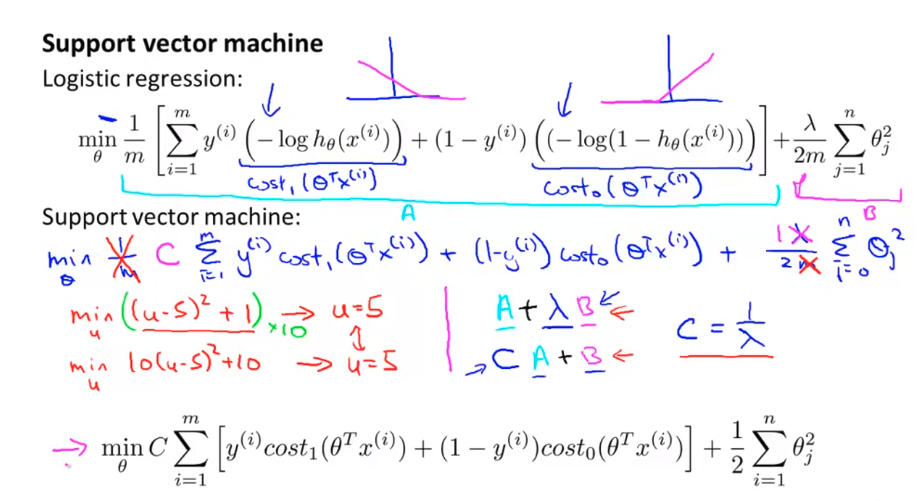
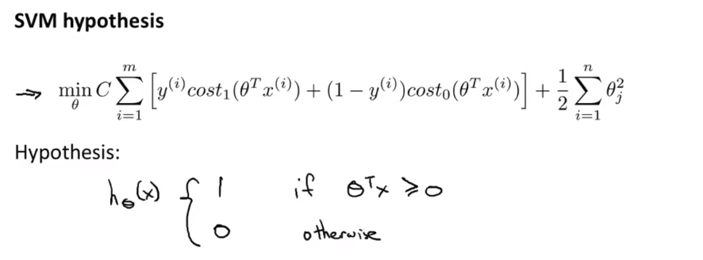
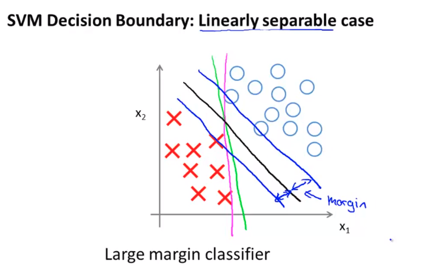
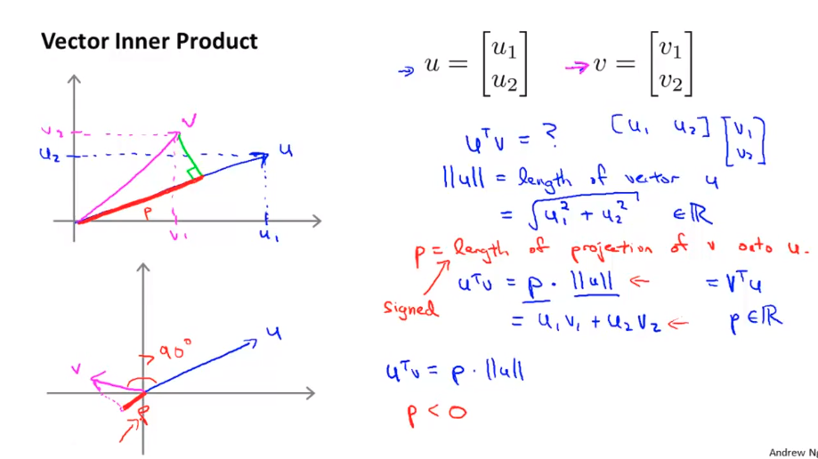
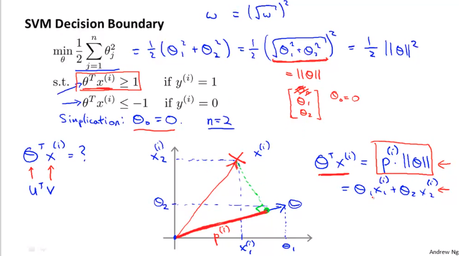
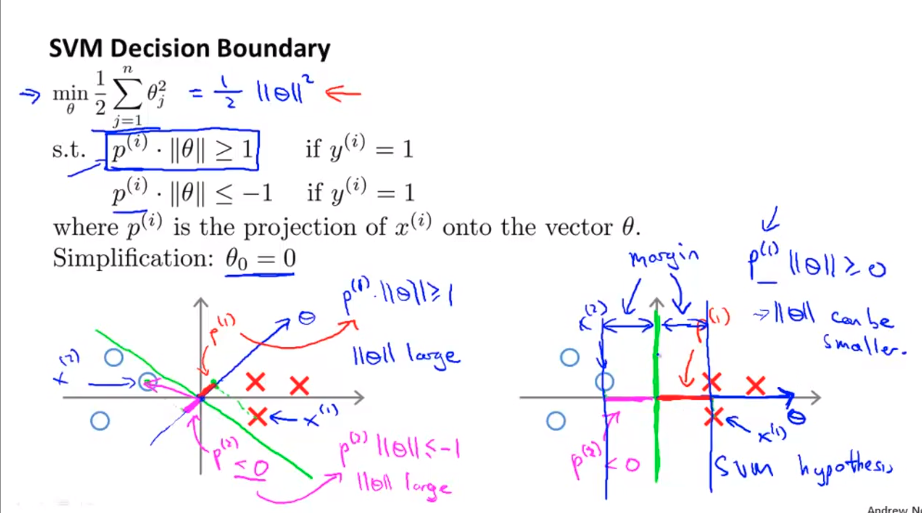
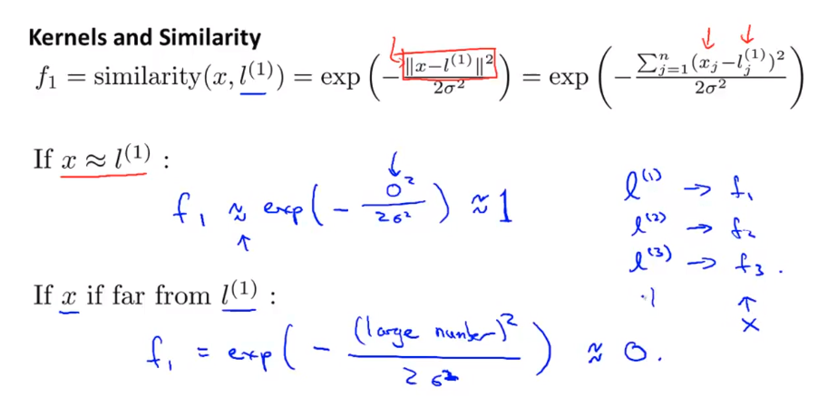
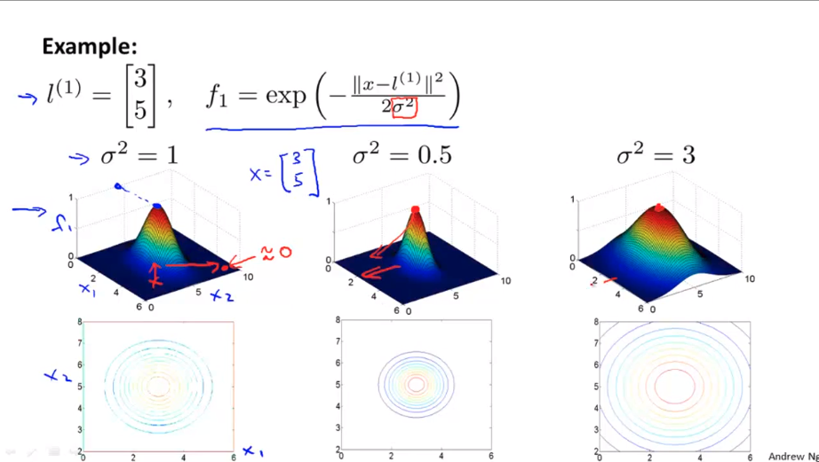
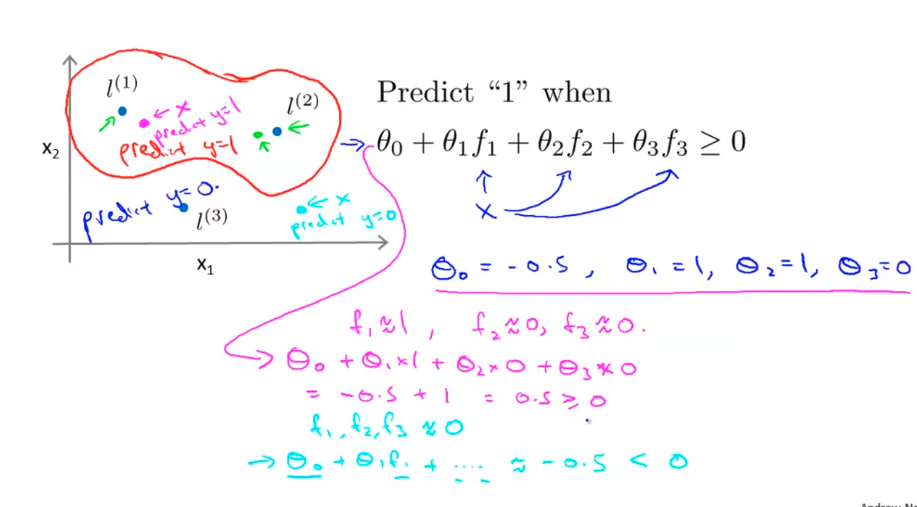

# Week 07

- Large Margin Classification
- Kernels
- SVMs in Practice 

------

### I. Large margin classification

#### 1. Optimization objectives

Alternative view of logistic regression

$h_\theta(x) = \frac{1}{1+e^{-\theta^Tx}} = g(z)$ ; __/￣

if $y = 1; \Rightarrow h_\theta(x) \approx 1$ when $\theta^Tx >> 0$

if $y = 0; \Rightarrow h_\theta(x) \approx 0$ when $\theta^Tx << 0$  

Cost of $-y\text{ }log(h_\theta(x)) + (1-y)\text{ }log(1-h_\theta(x)) $

=

Cost of $ -y\text{ }log(\frac{1}{1+e^{-\theta^Tx}}) + (1-y)\text{ }log(1-\frac{1}{1+e^{-\theta^Tx}})$ 

$y=1$ then \\__

$y = 0$ then __/

#### 2. Large Margin intuition

It is about C value;

#### 3. Math behind Large Margin intuition

### II. Kernels

Non-linear decision boundary: 

- $h_\theta(x) = 1 \text{ if polynomial } \theta_0 + \theta_1x_1 + .. \ge 0$ 

- which can be written as $\theta_0 + \theta_1f_1 + .. $ where $f_1 = x_1, ...$ 

  $\Rightarrow$ Question: is a better or different choice of features $f_1, f_2, ..$ 

We can learn pretty complex non-linear decision boundary, like what is just drew up where we predict positive when we're close to either one of the two landmarks. And we predict negative when we're very far away from any of the landmarks. And so this is part of the idea of kernels of and how we use them with the support vector machine, which is that we define these extra features using landmarks and similarity functions to learn more complex nonlinear classifiers.

### III. SVMs in practice

###   