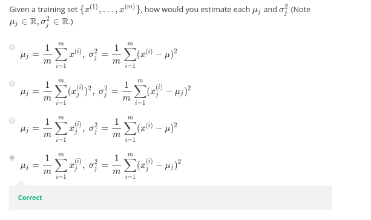

Your anomaly detection system flags x as anomalous whenever $p(x) \leq \epsilon$. Suppose your system is flagging too many things as anomalous that are not actually so (similar to supervised learning, these mistakes are called false positives). What should you do?

Try increasing $\epsilon$.

Try decreasing $\epsilon$. Correct

------

------

