# Week 09

- Anomaly Detection
  - Density Estimation
  - Building an Anomaly Detection System
  - Multivariate Gaussian Distribution (Optional)
- Recommender Systems
  - Predicting Movie Ratings
  - Collaborative Filtering
  - Low Rank Matrix Factorization

------

### I. Anomaly detection 

#### 1. Density Estimation 

- Calculate probability and check if its less or greater than an arbitrary value; 
  - Fraud detection
    - Idea is to model $p(x)$ from data
    - Check $p(x) \lt \epsilon$
  - Manufacturing
    - many features
    - decrease $\epsilon$
- Gaussian Distribution
  - ~ is distributed as
  - if $x$ is Gaussian Distribution with mean $\mu$, variance $\sigma^2$
  - $\sigma$ is standard deviation 

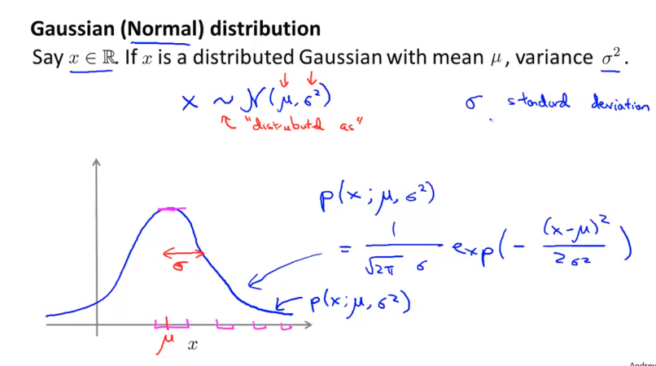

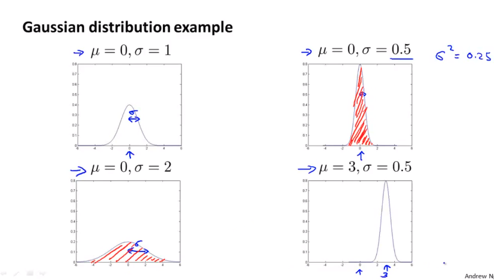

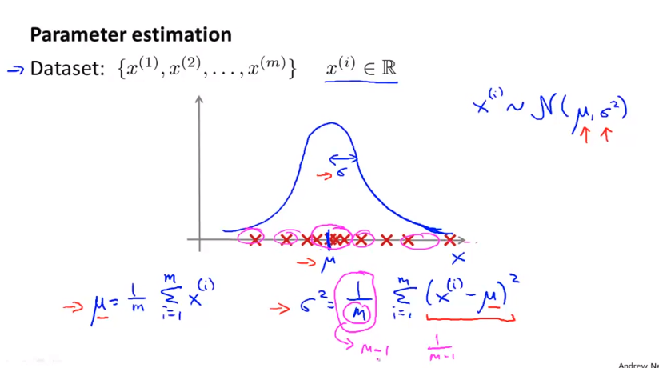 

**Algorithm**:

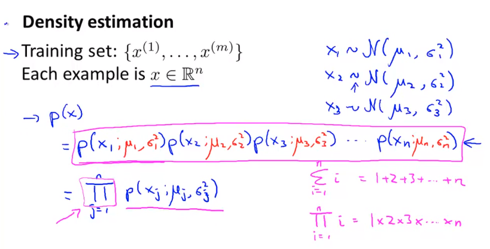

 

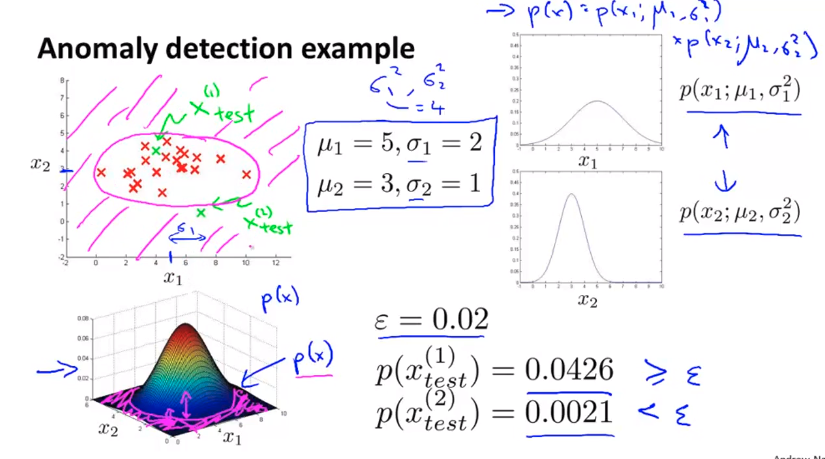

#### 2. Building Anomaly Detection System

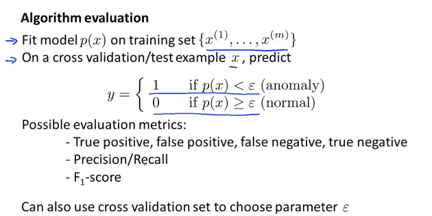 

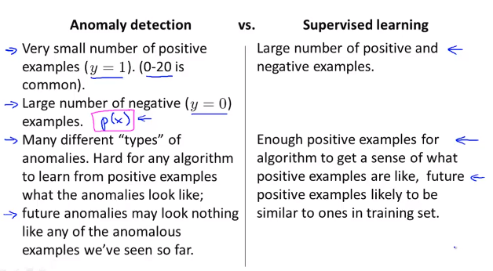 

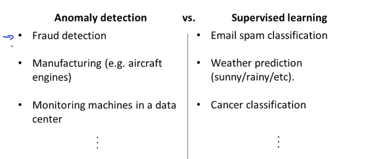 

#### 3. Choosing What Features to Use

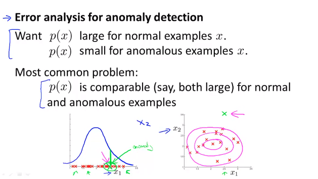

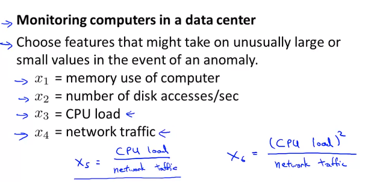 

### II. Recommender Systems

#### 1. Predicting Movie Ratings

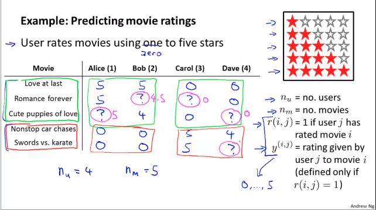

#### 2. Content Based Recommendations

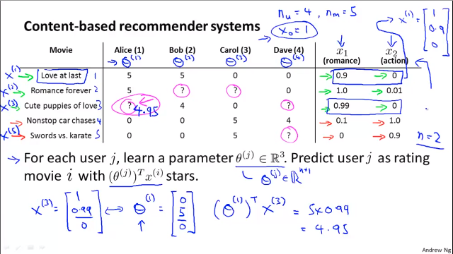

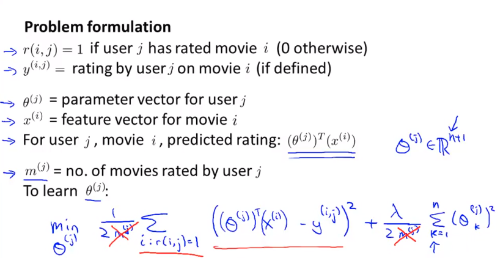

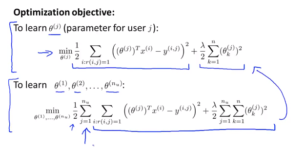 

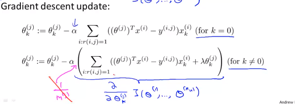

#### 4. Collaborative Filtering

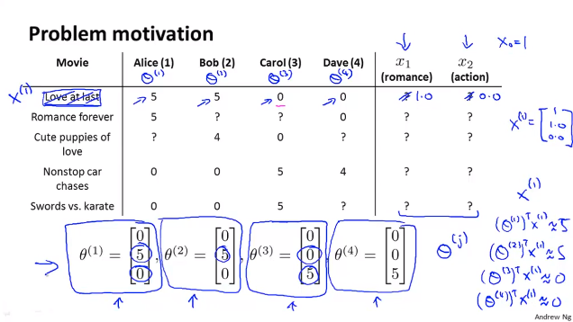

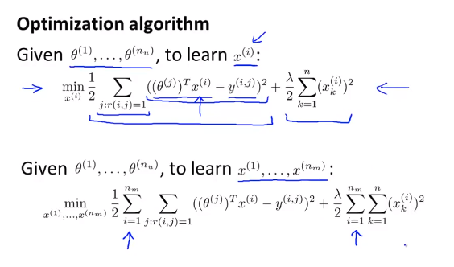

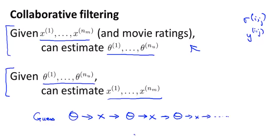

#### 2. Collaborative Filtering Algorithm

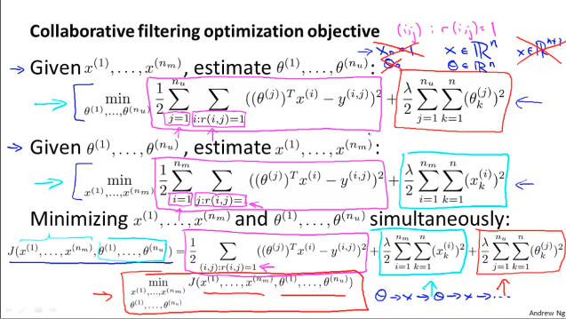

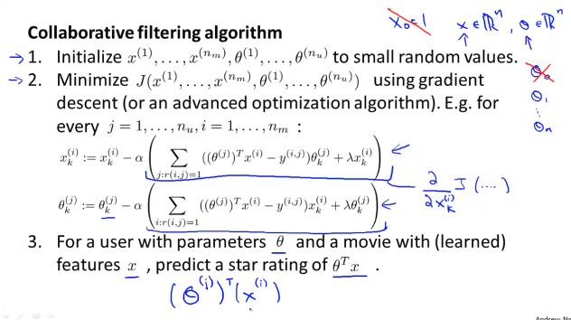

#### 3. Vectorization: Low Rank Matrix Factorization

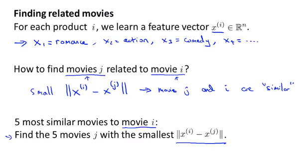

