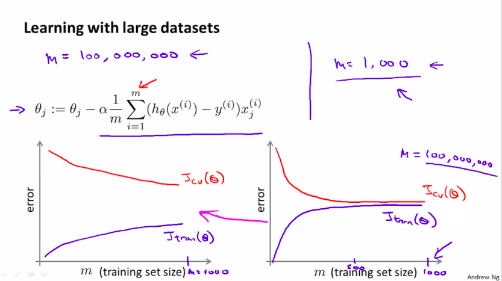
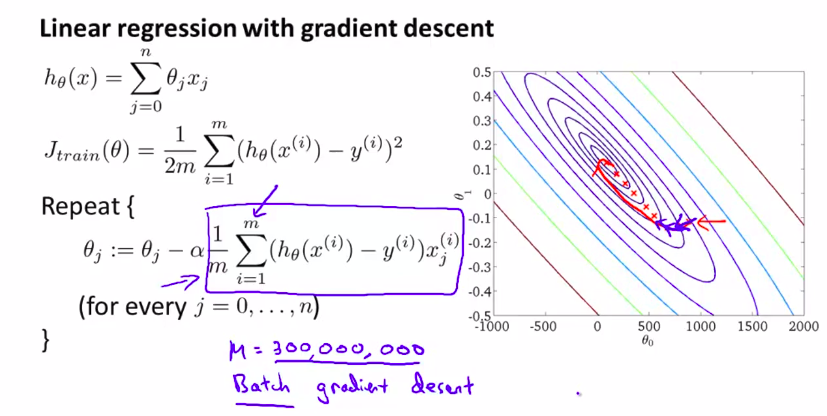
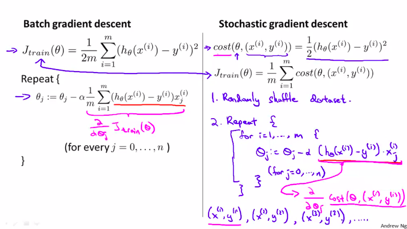
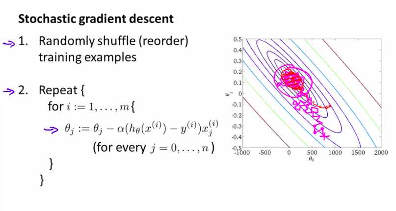
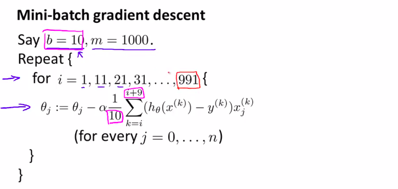
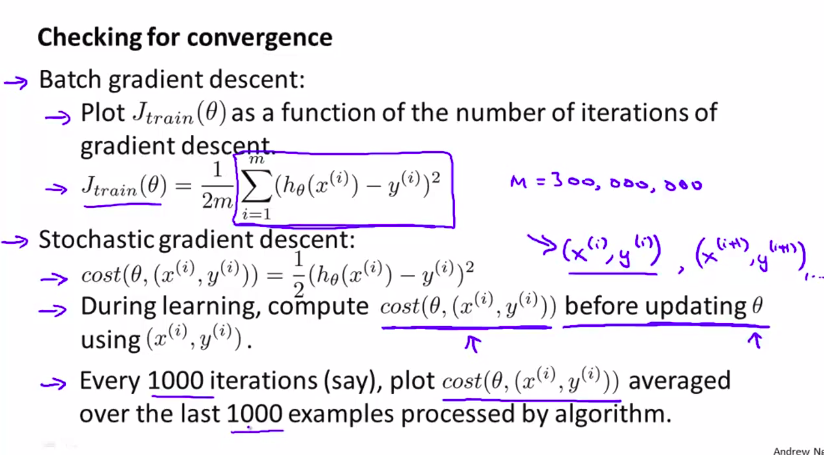
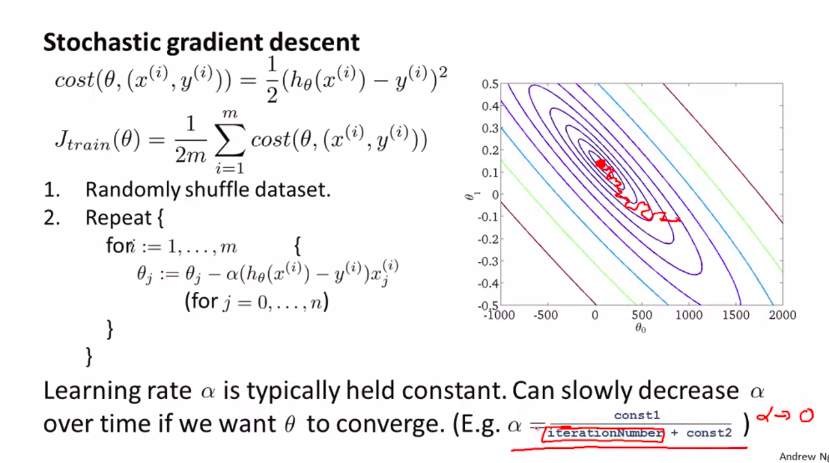
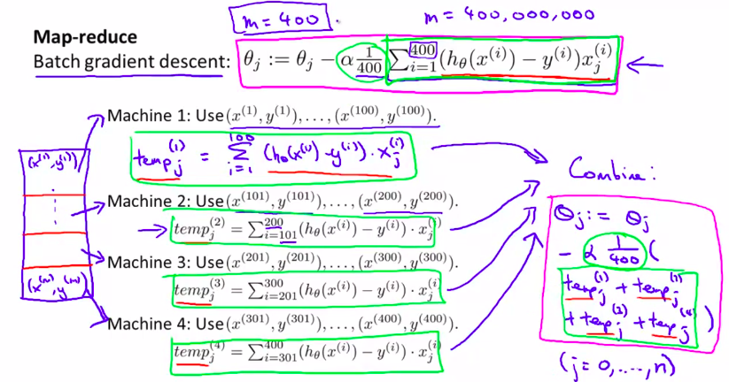

# Week 10

- Gradient descent with large dataset
  - Learning with large dataset
  - Stochastic gradient descent
  - Mini-batch gradient descent
  - Stochastic gradient descent convergence
- Advanced topics
  - Online learning
  - MR

------

### I. Gradient descent with large dataset

#### 1. Learning with large dataset

#### 2. Stochastic gradient descent

m can be 3,000,000

#### 3. Mini-Batch Gradient Descent

- Batch gradient descent: use all m examples in each iteration

- Stochastic gradient descent: use 1 example in each iteration 

- Mini batch gradient descent: use b example in each iteration

Why mini batch gradient look at b examples and stochastic gradient look at 1 example?

$\Rightarrow$ the answer is the vectorization in the $\sum$ part.

#### 4. Stochastic Gradient Descent Convergence

### II.Advanced topics

#### 1. Online learning

Learn $p(y=1|x; \theta)$

CTR

#### 2. Map Reduce and Data Parallelism

