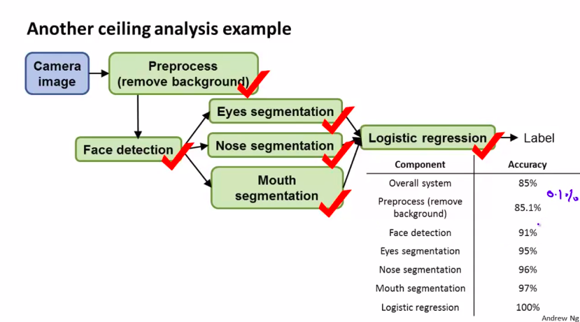
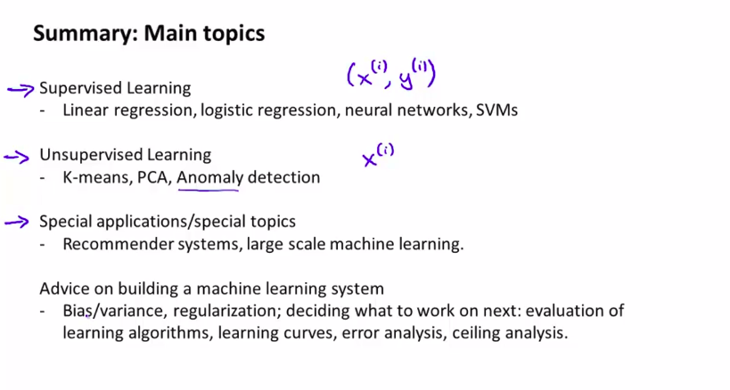

# Week 11

Photo OCR

- Problem description 
- Sliding windows
- Data and artificial data
- Ceiling Analysis

------

## I. Photo OCR

### 1. Problem description

- Steps:
  - Image
  - Text detection
  - Character segmentation
  - Character recognition 

###2. Sliding windows

- Sliding window detection
  - Take a picture
  - Choose a window size (patch image)
  - Slide using a step horizontally and vertically 
  - Change size and steps

#### 3. Getting Lots of Data and Artificial Data

- Original sources image or audio
  - Add noise, distortion randomly
- Make sure to have lower bias before expending the effort

#### 4. Ceiling Analysis

- Estimate error/ accuracy on each step of detection

## II. Summary

You passed this course! Your grade is 93.30%.

